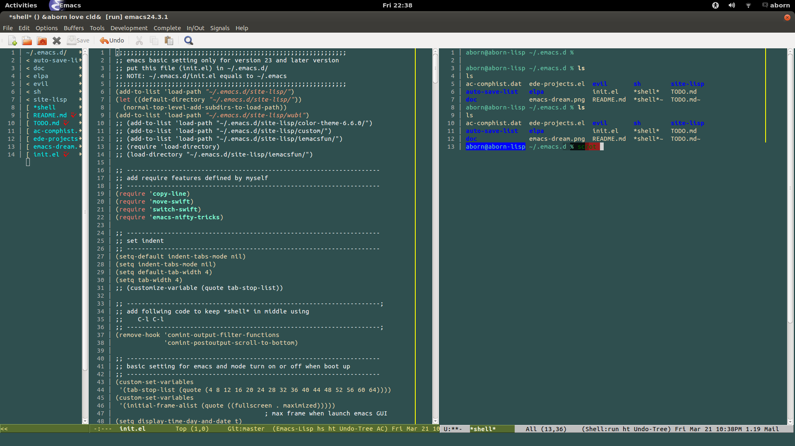
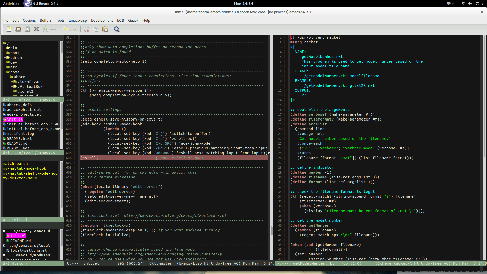
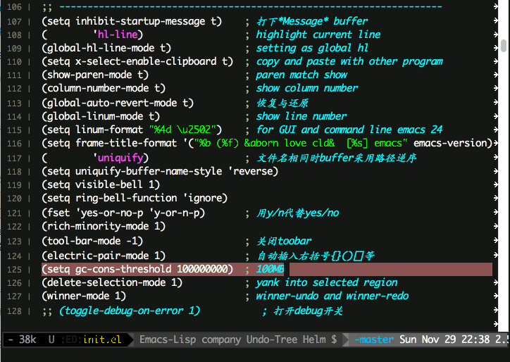

emacs.d
==========

## INTRO
This project is a useful configure file for emacs.  
All configure files can be used emacs version 23 or 23+.  
The latest emacs version 24.5 is recommanded!

## DOWNLOAD
You can download all history release version from
[here](https://github.com/aborn/ulitcs/releases "Release Version
Download").

## INSTALL
You can install this repository configure using one of following
methods.  

1. Download all file in this project and running configure  
> wget https://github.com/aborn/.emacs.d/archive/master.zip  
> unzip master.zip  
> cd .emacs.d-master/  
> ./sh/configure  

2. Or, you can also use git clone it to you home path
> cd ~  
> git clone https://github.com/aborn/.emacs.d.git

## PLATFORM
Different platform user different branch:
* **mac** branch use only for mac OSX system, this use CMD key as META.
* **linux** branch user only for linux system.

## GITHUB
1. generate the ssh key
2. copy the key to github.com
3. cp ./doc/config ~/.ssh/
4. git clone git@github.com:aborn/.emacs.d.git

> ... more refs to
  [github.sh](https://github.com/aborn/.emacs.d/blob/master/sh/github.sh
  "github.com clone setting initial.") and
  [git-usage](https://github.com/aborn/.emacs.d/blob/master/doc/git-usage.md
  "how to use git.")

## KEY-BINDING
C-control  
M-meta/alt  
Most key bindings are listed in file **key-binding.el**.  
Following list the **most popular hot-key**.   

* C-x C-n  switch to next buffer  [default C-.]
* C-x C-p  switch to previous buffer [default C-,]
* C-x C-l  copy a whole line
* C-i      just one space
* C-o      switch to other window
* C-x C-m  indent-region
* C-x k    kill-buffer
* M-w C-s  search and highlight all the matched content
* C-x C-y  open sr-speedbar
* C-'      move point to middle of line
* C-;      move forward by five line
* C-:      move backward by fine line
* C-x C-e  eval-current-buffer
* SHIFT-SPC  active chinese wubi input method
* M-$      ispell-word. Check and correct spelling of the word at point.
* C-c C-k  start-kbd-macro
* C-c C-l  end-kbd-macro
* C-c SPC  ace-jump-mode [also C-x SPC]
* C-j      swith-to-buffer
* M-j      find-file (open a file in a new buffer)
* M-m      switch to **shell** buffer

 Note: for more detail key-binding, please refs to the file
> [keybinding.md](https://github.com/aborn/.emacs.d/blob/master/doc/keybinding.md 
> "all hot-key instructions in this repo")

## OTHER OPEN SOURCE CODE
* all source code illustrations are showed in each module in file init.el

## DEPEND
* pls install "aspell ispell hunspell" before use checking and  
correcting spelling. ispell-*  M-$
* install following command to install this dependency.  
  > sudo apt-get install aspell ispell hunspell -y

## AUTHOR
Aborn Jiang (aborn.jiang@gmail.com)

## VERSION HISTORY
* 2013-11-04 v1.0   (add ./configure for install)
* 2013-11-23 v1.1   (add markdown major)
* 2014-01-06 v1.2   (add matlab mode and php mode)
* 2014-02-14 v1.3 (add switch to \*shell\* buffer switch-swift)
* 2014-03-02 v1.4   (add ace-jump-mode and quick-jump mode, string-dealing)
* 2014-04-24 v1.5   (add mit/gnu scheme mode insert-string.el maxframe.el)
* 2014-05-04 v1.6   (add ecb2.4 and jdee2.4.1)
* 2014-05-07 v1.6.2 (add window-dealing and big switch layout)
* 2014-05-12 v1.6.4 (add highlight-symbol.el for highlight occurrences)
* 2014-05-27 v1.6.6 (add auctex package in site-lisp)
* 2014-05-30 v1.6.7 (add latex-dealing.el and shell-dealing.el)
* 2014-07-26 v1.6.8 (add new branches:mac, linux, dp)
* 2015-06-28 v2.0   (use emacs24.5 for mac)
* 2015-11-27 v2.1   (use helm exec-path-from-shell highlight-indentation etc.)

## UPDATE TIME
2015-12-23

## EMACS SCREENSHOT
* emacs dream-theme  

* emacs default-theme  

* emacs ecb layout  

* helm swoop grep search  

